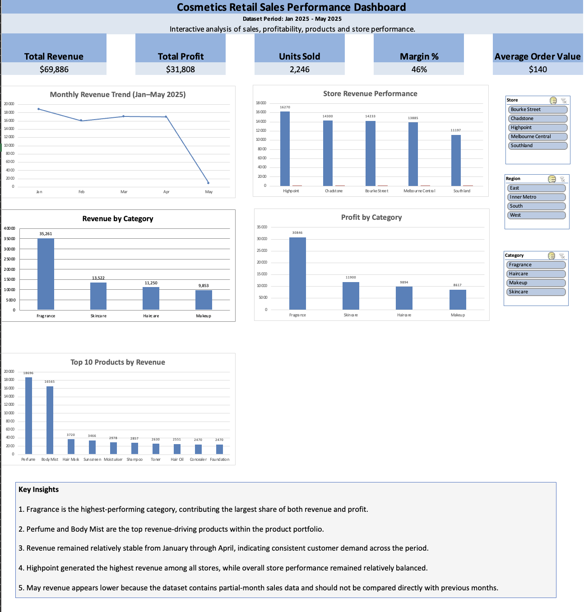
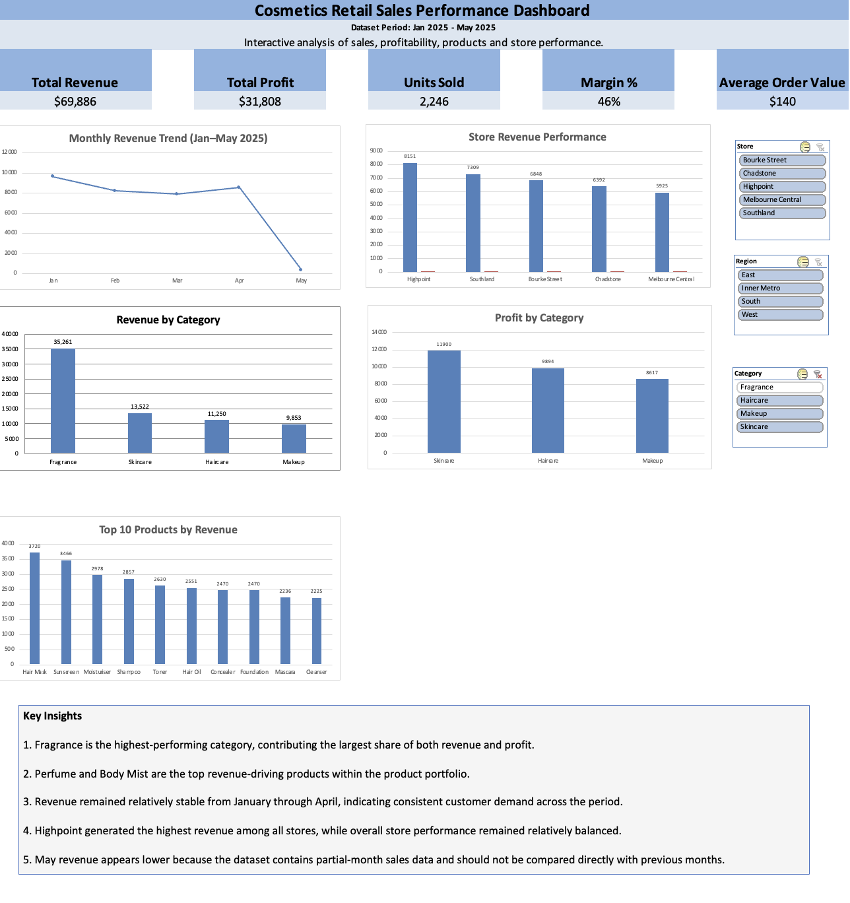
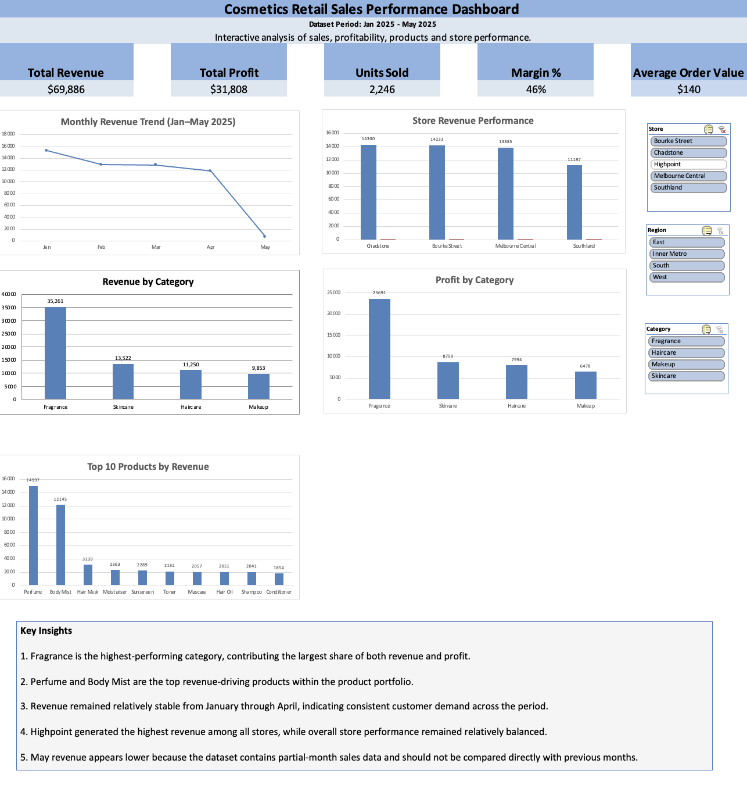

# Retail-Sales-Dashboard-Excel
Portfolio Project | Microsoft Excel | Retail Analytics | Dashboard Reporting
An interactive Excel dashboard designed to analyse cosmetics retail performance across sales, profit, product categories, and stores. Features dynamic filtering, visualisations, and KPI tracking to support data-driven business decisions and performance monitoring.

## Overview

This project analyses cosmetics retail sales data to evaluate revenue trends, profitability, store performance, and product category performance.

The dashboard was developed in Microsoft Excel using Pivot Tables, Pivot Charts, slicers, and KPI reporting techniques to support business decision-making.

## Business Objective

The objective was to create an interactive dashboard that enables stakeholders to:

- Monitor revenue and profitability
- Compare store performance
- Analyse category-level sales trends
- Identify top-performing products
- Explore data dynamically using slicers

## Dataset

The dataset contains transactional cosmetics retail sales data across multiple stores, product categories, and months.

Key fields include:

- Order ID
- Date
- Store
- Product Category
- Product Name
- Units Sold
- Revenue
- Profit

## Tools & Skills Used

### Microsoft Excel
- Excel Tables
- Pivot Tables
- Pivot Charts
- Slicers
- Structured References
- KPI Development
- Dashboard Design

### Analytics Skills
- Sales Analysis
- Profitability Analysis
- Product Performance Analysis
- Retail Analytics
- Business Reporting
- Data Visualisation

## Key Performance Indicators (KPIs)

| KPI | Value |
|------|------|
| Total Revenue | $69,886 |
| Total Profit | $31,808 |
| Units Sold | 2,246 |
| Profit Margin | 46% |
| Average Order Value | $140 |

## Key Insights

### 1. Fragrance drives business performance

Fragrance generated the highest revenue and profit among all product categories.

### 2. Product concentration

Perfume and Body Mist significantly outperformed the rest of the product portfolio.

### 3. Stable sales trend

Revenue remained relatively stable from January through April, indicating consistent customer demand.

### 4. Balanced store performance

Highpoint generated the highest revenue, while overall store performance remained relatively balanced.

### 5. Data quality consideration

May revenue appears lower because the dataset contains partial-month sales data.

## Dashboard Preview
## Dashboard Features

- Interactive slicers for Store and Category filtering
- Revenue and Profit KPI tracking
- Monthly sales trend analysis
- Product category performance analysis
- Store-level performance comparison
- Dynamic dashboard reporting

### Full Dashboard

### Fragrance Category Analysis

### Highpoint Store Analysis

## Files

- cosmetics_retail_dataset.xlsx
- dashboard_full.png
- dashboard_fragrance.png
- dashboard_highpoint.png

## Business Recommendations

- Increase focus on Fragrance products due to strong revenue and profit contribution.
- Expand inventory allocation for Perfume and Body Mist products.
- Monitor lower-performing categories to identify growth opportunities.
- Investigate Highpoint store strategies for replication across locations.
  
## Project Outcome

Developed an interactive retail analytics dashboard that enables users to analyse sales performance, profitability, product performance, and store-level trends through dynamic reporting and visualisation.
